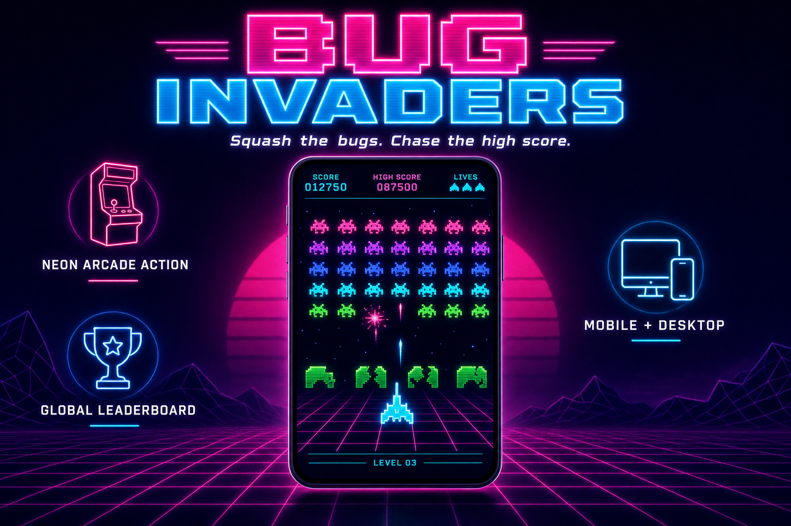

<sub>Product-concept mockup — an aspirational marketing render, not a literal screenshot of the app.</sub>

# Bug Invaders

A neon synthwave take on the arcade classic. You pilot a ship at the bottom of the
screen and squash a descending swarm of glowing **bugs** before they reach you.
Grab the gold power-up for a spread shot, ride out the waves, and stamp your
initials on the global leaderboard.

Day 43 of Savion's [100 Day AI Build Challenge](https://www.100dayaichallenge.com/share/savion).

## Features

- **Classic invaders mechanics** — a marching swarm that speeds up as it thins, destructible shields, return fire, and endless escalating waves.
- **Neon synthwave skin** — glowing pixel bugs, a perspective grid floor, CRT scanlines, particle bursts, and screen shake.
- **Spread-shot power-up** — occasionally dropped by a squashed bug; catch it for a temporary three-way cannon.
- **Synthesized sound** — shoot, explode, power-up, and wave-clear beeps generated live with the WebAudio API (no audio files).
- **Global leaderboard** — arcade-style 3-initial entry, backed by Supabase.
- **Keyboard + touch** — arrows/space on desktop, on-screen pads on mobile. The canvas scales to any screen.

## Controls

| Key | Action |
| --- | --- |
| ← → (or A / D) | Move ship |
| Space (or ↑) | Fire |
| P / Esc | Pause |
| M | Mute |

On touch devices, left/right pads and a FIRE button appear below the game.

## Install

```bash
git clone https://github.com/Still-InFrame/day-43-invaders.git
cd day-43-invaders
npm install
cp .env.local.example .env.local   # enables the Supabase leaderboard locally
npm run dev
```

Then open http://localhost:3000.

## Stack

- **Next.js (App Router) + React + TypeScript**
- **Tailwind CSS** for the UI chrome
- **HTML5 Canvas** for the game (vanilla `requestAnimationFrame` loop, no game engine)
- **WebAudio API** for synthesized sound
- **Supabase** (Postgres + RLS) for the leaderboard

## A note on the leaderboard

Scores are submitted with a public insert (no login), so the board is spoofable by
design — that trade keeps it a friction-free arcade cabinet rather than an
account-gated app. Fine for a personal challenge build; not how you'd do it for a
competitive game.

---

Part of the [100 Day AI Build Challenge](https://www.100dayaichallenge.com/share/savion) — one new app a day.
